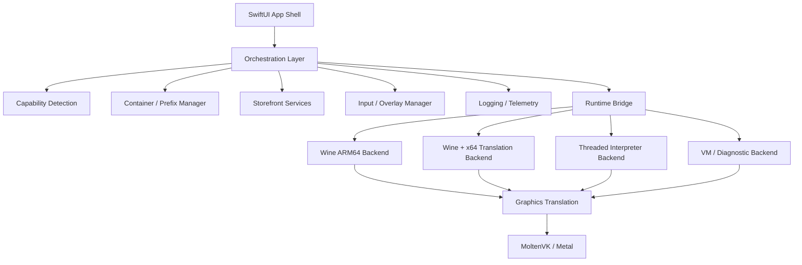

# Proposed architecture

## Design goals

1. **iOS-native shell, runtime-agnostic core**
2. **Capability-driven backend selection**
3. **Game/container-first UX**
4. **Separation between policy-constrained and research builds**
5. **AI-agent-friendly code organization**

## Top-level architecture



## Layer breakdown

## 1. SwiftUI App Shell

Responsibilities:
- library/home UI,
- game detail UI,
- settings,
- import flow,
- controller/touch overlay configuration,
- runtime status surfaces.

Why SwiftUI?
- aligns with Whisky and UTM frontend patterns,
- best fit for Apple platform APIs,
- easier future universal app story across iPhone/iPad.

## 2. Orchestration Layer

Responsibilities:
- coordinate shell ↔ runtime decisions,
- schedule downloads/imports,
- manage app lifecycle transitions,
- persist launch history,
- surface warnings and blockers.

Suggested Swift modules:
- `CellarCore` — domain models and planning
- future app target — UI and iOS integrations

## 3. Capability Detection

The runtime should decide backend eligibility using explicit capability data rather than ad-hoc checks.

Suggested model:

- distribution channel
  - app store
  - testflight
  - developer-signed
  - altstore
  - jailbreak
- execution mode
  - no JIT
  - debugger-attached JIT
  - AltJIT
  - JitStreamer
  - jailbreak entitlement
  - threaded interpreter only
- device resources
  - increased memory limit
  - thermal state
  - available storage
- graphics availability
  - MoltenVK allowed/present
  - Metal feature set
- file access mode
  - managed copy
  - security-scoped bookmark

## 4. Container / Prefix Manager

This is the most important product abstraction.

A container should represent:
- runtime backend choice,
- prefix/bottle root,
- imported game payload or install directory,
- metadata,
- launch config,
- save path mappings,
- overlay/input profile,
- caches/logs.

### Suggested on-disk shape

```text
Containers/
  <UUID>/
    Metadata.json
    Prefix/
    GamePayload/
    Runtime/
    Cache/
      Shaders/
      Translation/
    Saves/
    Logs/
    Imports/
      bookmarks.json
```

### Metadata fields

- title
- source type (`localImport`, `steam`, `epic`, `gog`, `amazon`)
- guest architecture (`winArm64`, `winArm64EC`, `winX64`, `winX86`)
- chosen backend
- graphics mode
- input profile id
- save-sync policy
- last successful launch
- current policy risk markers

## 5. Runtime Bridge

This layer exists to keep Swift code clean.

Responsibilities:
- expose C/C++ runtime functions to Swift,
- start/stop embedded runtime loops,
- pass environment/configuration values,
- manage callback streams for logs, lifecycle, and state.

Suggested implementation languages:
- C / C++ / Objective-C++ for bridges,
- Swift for orchestration and public models.

## Backend strategy

## Backend A — Wine ARM64

Best for:
- earliest proof of concept,
- avoiding x64 CPU translation initially,
- titles or launchers with ARM64/ARM64EC viability.

Pros:
- lower complexity,
- less dependence on dynarec,
- cleaner iOS-first story.

Cons:
- narrower title compatibility.

## Backend B — Wine + x64 translation

Best for:
- the real long-term compatibility goal.

Potential sub-options:
- Box64-like path,
- FEX-like path,
- QEMU-user style path,
- hybrid evolution over time.

Pros:
- aligns with user expectations for Windows game support.

Cons:
- JIT sensitivity,
- more memory pressure,
- harder policy story.

## Backend C — threaded interpreter / TCTI-like mode

Best for:
- no-JIT fallback,
- App Store-safe experimentation,
- proof-of-life on locked-down devices.

Pros:
- works when JIT is unavailable.

Cons:
- probably too slow for many real games.

## Backend D — VM / diagnostic fallback

Best for:
- development diagnostics,
- compatibility experiments,
- not the main consumer UX.

## Graphics subsystem

## Preferred target direction

### D3D 9/10/11 path

- D3D calls inside Wine
- DXVK-style translation
- Vulkan
- MoltenVK
- Metal

### D3D12 path

- VKD3D-Proton
- Vulkan
- MoltenVK
- Metal

### Fallback path

- WineD3D or another lower-performance renderer

## Graphics engineering notes

- cache behavior must be explicit,
- shader cache size belongs in per-game tuning,
- Metal/MoltenVK device compatibility must be reported to the shell,
- first MVP should prefer one narrow graphics path that can be measured well.

## Input subsystem

The input stack should mirror GameNative/Winlator concepts while using Apple-native frameworks.

### Requirements

- touch overlay profiles,
- virtual gamepad state,
- GameController.framework support,
- iPad keyboard/mouse support,
- haptics/rumble fallback,
- runtime in-game overlay to edit mappings.

### Suggested concept split

- `InputProfile`
- `VirtualGamepadLayout`
- `PhysicalControllerBinding`
- `GameInputSession`
- `OverlayState`

## Audio subsystem

Suggested responsibilities:
- `AVAudioSession` ownership,
- route-change handling,
- interruption handling,
- runtime sink bridge,
- buffer sizing profiles per game.

## Storefront services

These should be optional and isolated from the core runtime.

Suggested protocol shape:

- `StorefrontService`
  - authenticate
  - refresh library
  - request install plan
  - fetch cloud-save metadata
  - sync saves

Concrete implementations later:
- Steam
- Epic
- GOG
- Amazon
- Local Import

## Distribution-aware product architecture

The project should expect at least two SKUs or build modes.

### Research build

- full backend set,
- debugger/JIT helpers allowed,
- logging/diagnostics exposed,
- local import first,
- storefronts optional.

### Constrained build

- fewer backends,
- maybe interpreter-only,
- fewer risky features,
- no assumption of storefront download support.

## Recommended code organization

```text
Package.swift
Sources/
  CellarCore/
    Domain/
    Planning/
    Policy/
    Storefront/
Tests/
  CellarCoreTests/
App/   (future Xcode target)
Runtime/ (future native bridge code)
Vendor/  (future tracked third-party deps)
```

## Architectural decisions already implied by this research

1. The host app should be **Swift-first**, not Kotlin-first.
2. The runtime should be **embedded**, not subprocess-first.
3. Backend selection should be **data-driven**.
4. Storefront features should be **optional layers**, not core assumptions.
5. App Store compatibility should be treated as a **separate product lane**, not the default MVP target.
